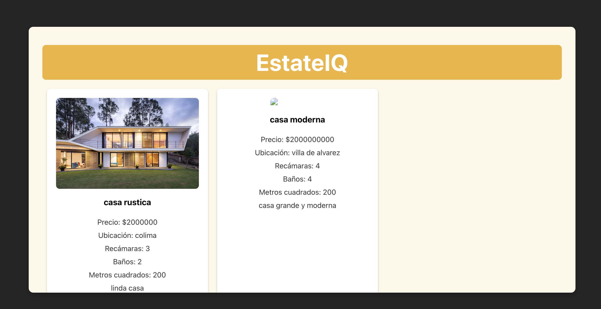
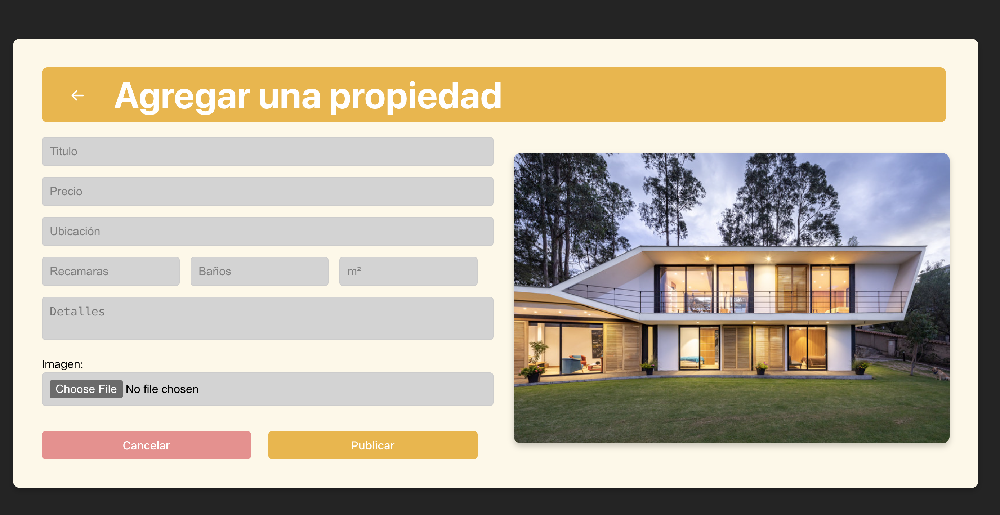

# EstateIQ

EstateIQ es una aplicación para la gestión de propiedades inmobiliarias. Permite a los usuarios listar propiedades existentes y agregar nuevas propiedades a la base de datos. Esta aplicación está construida con React y TypeScript, y utiliza una API para gestionar las propiedades.

## Contenidos

- [Instalación](#instalación)
- [Descripcion del proyecto](#descripcion-del-proyecto)
  - [Estructura del proyecto](#estructura-del-proyecto)
  - [Uso del proyecto](#uso-del-proyecto)
- [Prototivos de la vista](#prototivos-de-la-vista)
- [Descripcion de las pruebas](#descripcion-de-las-pruebas)
- [Dependenicas](#dependencias)

## Instalación
1. Clonar el siguiente repositorio:
   
   ```sh
   git clone https://github.com/diegogodinezr/EstateIQ_Web.git
   ```
2. Navegar al directorio del proyecto:
   
   ```sh
   cd EstateIQ_Web
   ```
3. Instalar las dependencias:
   
    ```sh
    npm install
    ```
4. Iniciar la aplicación:
    
    ```sh
    npm run dev
      ```
5. La aplicación se ejecutará en el puerto 5173 y podras acceder con:
      
    ```sh
    http://localhost:5173/
      ```

## Descripcion del proyecto

### Estructura del proyecto

- `src/`
  - `components/`
    - `Home.tsx` - Componente que muestra la lista de propiedades.
    - `AddProperty.tsx` - Componente para agregar nuevas propiedades.
  - `api/`
    - `property.ts` - Funciones para interactuar con la API de propiedades.
  - `App.tsx` - Componente principal de la aplicación.
  - `index.tsx` - Punto de entrada de la aplicación.
  - `setupTests.ts` - Configuración inicial para las pruebas.
- `public/` - Archivos públicos (HTML, imágenes, etc.).
- `jest.config.js` - Configuración de Jest.
- `tsconfig.json` - Configuración de TypeScript.
- `.eslintrc.js` - Configuración de ESLint.
- `package.json` - Dependencias y scripts del proyecto.

### Uso del proyecto

#### Vista de Listado de Propiedades
El componente **Home.tsx** muestra una lista de propiedades disponibles. Cada tarjeta de propiedad incluye una imagen, el título, el precio, la ubicación, el número de recámaras, baños, metros cuadrados y una descripción breve.

Para agregar una nueva propiedad, haz clic en el botón "Agregar una propiedad" que te redirigirá a la vista de agregar propiedad.

#### Vista de Agregar Propiedad
El componente **AddProperty.tsx** proporciona un formulario para agregar una nueva propiedad. Los campos requeridos incluyen título, precio, ubicación, recámaras, baños, metros cuadrados y una descripción. También puedes subir una imagen de la propiedad.

Al completar y enviar el formulario, la nueva propiedad se agrega a la base de datos y se muestra un mensaje de éxito.

## Prototivos de la vista

1. **Vista de Listado de Propiedades (Home)**
   - Al acceder a la aplicación, la primera vista que se muestra es la lista de propiedades.
   - Cada propiedad incluye detalles como título, precio, ubicación, número de recámaras, baños, metros cuadrados y una descripción.
   - Las imágenes de la propiedad también se muestran en una cuadrícula.
   - Hay un botón para agregar una nueva propiedad que redirige a la vista de agregar propiedad.

  

2. **Vista de Agregar Propiedad (Add Property)**
   - Para acceder a esta vista, haz clic en el botón "Agregar una propiedad" en la vista principal.
   - El formulario permite ingresar detalles de la propiedad, incluyendo título, precio, ubicación, número de recámaras, baños, metros cuadrados y una descripción.
   - Se pueden cargar imágenes de la propiedad.
   - Hay un botón para cancelar y volver a la vista principal.
   - Al enviar el formulario, la propiedad se agrega y muestra un mensaje de éxito.

    

### Cómo Utilizar las Vistas

1. **Navegación a la Vista de Listado de Propiedades**
   - Simplemente accede a la URL principal de la aplicación. Esta vista se carga por defecto y muestra todas las propiedades disponibles.

2. **Agregar una Nueva Propiedad**
   - Haz clic en el botón "Agregar una propiedad" en la vista principal.
   - Completa el formulario con la información requerida.
   - Carga una imagen de la propiedad.
   - Haz clic en el botón "Publicar" para agregar la propiedad.
   - Verifica que aparezca el mensaje de éxito y que la propiedad se haya añadido a la lista.

## Descripcion de las pruebas

### Pruebas
Este proyecto utiliza Jest y React Testing Library para las pruebas. Los tests se encuentran en `App.test.tsx` y cubren los siguientes casos:

- Verificación de que las propiedades se recuperan y muestran correctamente en la vista de listado de propiedades (`Home.tsx`).

- Verificación de que los datos del formulario se envían correctamente en la vista de agregar propiedad (`AddProperty.tsx`).


#### Pruebas para `Home.tsx`

```tsx
import { render, screen, waitFor } from '@testing-library/react';
import { BrowserRouter as Router } from 'react-router-dom';
import PropertyListing from './Home';
import { getProperties } from '../api/property';
import { vi } from 'vitest';

// Mockea la función getProperties
vi.mock('../api/property');
const mockGetProperties = getProperties as vi.MockedFunction<typeof getProperties>;

const mockProperties = [
  {
    _id: '1',
    title: 'Casa 1',
    price: 50000,
    location: 'Colima',
    bedrooms: 5,
    bathrooms: 3,
    squaremeters: 120,
    description: 'Casa bonita',
    images: ['/path/to/image1.jpg'],
  },
  {
    _id: '2',
    title: 'Casa 2',
    price: 75000,
    location: 'Guadalajara',
    bedrooms: 4,
    bathrooms: 2,
    squaremeters: 150,
    description: 'Casa grande',
    images: ['/path/to/image2.jpg'],
  },
];

describe('PropertyListing Component', () => {
  beforeEach(() => {
    mockGetProperties.mockResolvedValue(Promise.resolve({ data: mockProperties }) as any);
  });

  test('recupera y muestra las propiedades correctamente', async () => {
    render(
      <Router>
        <PropertyListing />
      </Router>
    );

    await waitFor(() => {
      expect(screen.getByText('Casa 1')).toBeInTheDocument();
      expect(screen.getByText('Casa 2')).toBeInTheDocument();
    });

    expect(screen.getByText('Casa 1')).toBeInTheDocument();
    expect(screen.getByText('Precio: $50000')).toBeInTheDocument();
    expect(screen.getByText('Ubicación: Colima')).toBeInTheDocument();
    expect(screen.getByText('Recámaras: 5')).toBeInTheDocument();
    expect(screen.getByText('Baños: 3')).toBeInTheDocument();
    expect(screen.getByText('Metros cuadrados: 120')).toBeInTheDocument();
    expect(screen.getByText('Casa bonita')).toBeInTheDocument();
    expect(screen.getByText('Casa 2')).toBeInTheDocument();
    expect(screen.getByText('Precio: $75000')).toBeInTheDocument();
    expect(screen.getByText('Ubicación: Guadalajara')).toBeInTheDocument();
    expect(screen.getByText('Recámaras: 4')).toBeInTheDocument();
    expect(screen.getByText('Baños: 2')).toBeInTheDocument();
    expect(screen.getByText('Metros cuadrados: 150')).toBeInTheDocument();
    expect(screen.getByText('Casa grande')).toBeInTheDocument();

    const images = screen.getAllByRole('img');
    expect(images[0]).toHaveAttribute('src', '/path/to/image1.jpg');
    expect(images[1]).toHaveAttribute('src', '/path/to/image2.jpg');
  });
});
```

#### Pruebas para `AddProperty.tsx`

```tsx
import { render, screen, fireEvent, waitFor } from '@testing-library/react';
import { BrowserRouter as Router } from 'react-router-dom';
import AddProperty from './AddProperty';
import { addPropertyRequest } from '../api/property';
import { vi } from 'vitest';

// Mockea la función addPropertyRequest
vi.mock('../api/property');
const mockAddPropertyRequest = addPropertyRequest as vi.MockedFunction<typeof addPropertyRequest>;

describe('AddProperty Component', () => {
  beforeEach(() => {
    vi.clearAllMocks();
  });

  test('envía los datos del formulario correctamente', async () => {
    mockAddPropertyRequest.mockResolvedValue({ status: 201 });

    render(
      <Router>
        <AddProperty />
      </Router>
    );

    fireEvent.change(screen.getByPlaceholderText(/Titulo/i), { target: { value: 'Casa Bonita' } });
    fireEvent.change(screen.getByPlaceholderText(/Precio/i), { target: { value: '500000' } });
    fireEvent.change(screen.getByPlaceholderText(/Ubicación/i), { target: { value: 'Ciudad' } });
    fireEvent.change(screen.getByPlaceholderText(/Recamaras/i), { target: { value: '3' } });
    fireEvent.change(screen.getByPlaceholderText(/Baños/i), { target: { value: '2' } });
    fireEvent.change(screen.getByPlaceholderText(/m²/i), { target: { value: '120' } });
    fireEvent.change(screen.getByPlaceholderText(/Detalles/i), {

 target: { value: 'Hermosa casa en la ciudad.' } });

    const file = new File(['dummy content'], 'example.png', { type: 'image/png' });
    const input = screen.getByLabelText(/Imagen:/i) as HTMLInputElement;
    fireEvent.change(input, { target: { files: [file] } });

    fireEvent.click(screen.getByText(/Publicar/i));

    await waitFor(() => {
      expect(mockAddPropertyRequest).toHaveBeenCalledTimes(1);
      const formData = mockAddPropertyRequest.mock.calls[0][0] as FormData;
      expect(formData.get('title')).toBe('Casa Bonita');
      expect(formData.get('price')).toBe('500000');
      expect(formData.get('location')).toBe('Ciudad');
      expect(formData.get('bedrooms')).toBe('3');
      expect(formData.get('bathrooms')).toBe('2');
      expect(formData.get('squaremeters')).toBe('120');
      expect(formData.get('description')).toBe('Hermosa casa en la ciudad.');
      expect(formData.get('images')).toBeInstanceOf(File);
    });

    expect(screen.getByText('¡Propiedad agregada con éxito!')).toBeInTheDocument();
  });
});
```


### Ejecución de Pruebas

Para ejecutar las pruebas, utiliza el siguiente comando:
```bash
npm test
```
Esto ejecutará todos los tests definidos y mostrará los resultados en la terminal.

## Dependencias

### Dependencias de Producción

- `react`: Librería para construir interfaces de usuario.
- `react-dom`: Paquete para trabajar con el DOM en aplicaciones React.
- `react-router-dom`: Enrutador para aplicaciones web de React.
- `axios`: Cliente HTTP para realizar peticiones a la API.

### Dependencias de Desarrollo

- `typescript`: Lenguaje de programación que se basa en JavaScript y añade tipos estáticos.
- `@types/react`: Tipos de TypeScript para React.
- `@types/react-dom`: Tipos de TypeScript para React DOM.
- `@types/react-router-dom`: Tipos de TypeScript para React Router DOM.
- `@testing-library/react`: Herramientas para probar componentes de React.
- `jest`: Framework de pruebas de JavaScript.
- `vitest`: Framework de pruebas para Vite.
